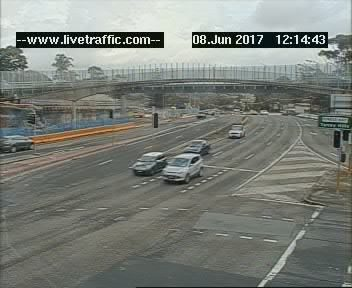
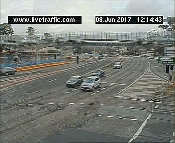
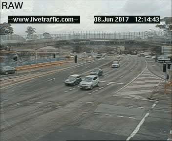

# RMS Camera
Python scripts for collecting and creating GIFs or MP4s of NSW RMS traffic camera images. Cameras can be viewed on [livetraffic.com](https://www.livetraffic.com/desktop.html#cameraview)


## collect.py
This script polls _rms.nsw.gov.au_ for new traffic camera images every 30 seconds. If a new image is found, it is downloaded and (optionally) filtered. The filtered images are saved in their own directories. New images are received from cameras evey minute ± 15 seconds.

```
usage: collect.py [-h] [-c CAMERA] [-p PATH] [--filter]

optional arguments:
  -h, --help  show this help message and exit
  -c CAMERA   Traffic camera name
  -p PATH     Path to save images (default="./download")
  --filter    Enable image filtering (default=false)
```


### Examples
```
python collect.py -c anzacbr

python collect.py --filter -c anzacbr -p "Anzac Bridge"
```

### Filtering
Each individual frame can optionally be filtered with a [PIL/Pillow ImageFilter](http://pillow.readthedocs.io/en/3.4.x/reference/ImageFilter.html) using the `--filter` switch. If enabled, the images are passed through a separate Detail and Sharpen filter. The output of each filter is placed in `<PATH>/filtered/detail` and `<PATH>/filtered/sharpen` respectively.

Unfiltered | Detail | Sharpen
-----------| ------ | -------
 |  | 

**Comparison GIF**




### File naming
Downloaded images are named based on the camera they were captured by, and a UNIX timestamp of when they were downloaded. Example:
```
anzacbr-1496647687.878115.jpg
```


### Cameras
Valid camera names can be found in [cameras.md](cameras.md). Camera positions and directions can be viewed on the [livetraffic.com](https://www.livetraffic.com/desktop.html) map.


### Dependencies
 - [PIL](https://pypi.python.org/pypi/Pillow) >= 4.1.1
 - [requests](https://pypi.python.org/pypi/requests) >= 2.17.3


## gif.py
This script creates an animated GIF from a folder containing a JPG image sequence. This script is not limited to working with images created by `collect.py`, it will work with any JPG image sequence. GIFs are limited to 500 frames in length. A warning will appear if more than 500 images are found. For image sequences larger than 500 frames, use mp4.py.

```
usage: gif.py [-h] [-i INPUT] [-o OUTPUT] [-f FPS]

optional arguments:
  -h, --help  show this help message and exit
  -i INPUT    Path to folder containing images
  -o OUTPUT   Path to save GIF (default="./anim.gif")
  -f FPS      GIF FPS (default=8)
```


### Examples
```
python gif.py -i "Anzac Bridge"

python gif.py -i "Anzac Bridge" -o "anzacbr.gif" -f 20
```

**GIF Sample**


### Dependencies
 - [imageio](https://pypi.python.org/pypi/imageio) >= 2.2.0


## mp4.py
This script creates an animated GIF from a folder containing a JPG image sequence. This script is not limited to working with images created by `collect.py`, it will work with any JPG image sequence. 

```
usage: mp4.py [-h] [-i INPUT] [-p PREFIX] [-o OUTPUT] [-f FPS]

optional arguments:
  -h, --help  show this help message and exit
  -i INPUT    Path to folder containing images
  -p PREFIX   Image prefix
  -o OUTPUT   Path to save MP4 (default="./anim.mp4")
  -f FPS      MP4 FPS (default=8)

```


## Examples
```
python mp4.py -i "Anzac Bridge" -p "anzacbr"

python mp4.py -i "Anzac Bridge" -p "anzacbr" -o "anzacbr.mp4" -f 20
```

**MP4 Sample (YouTube)**

[](https://www.youtube.com/watch?v=9KjFxJtwjWA)


### Dependencies
 - [ffmpeg](https://ffmpeg.org) >= 3.3.1
